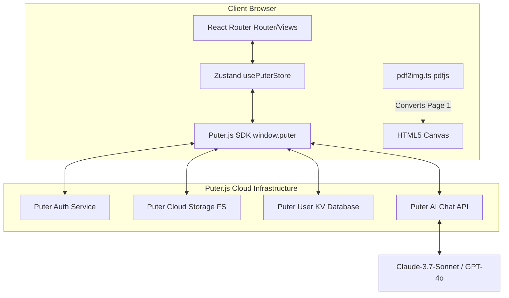
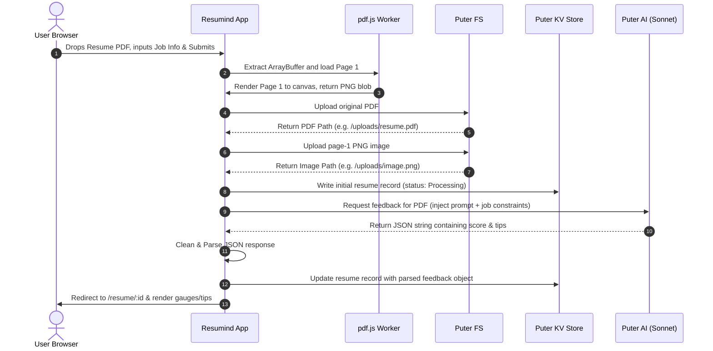

# 🏛️ Resumind | System Architecture

This document outlines the architectural patterns, component interactions, and data storage designs for the **Resumind (AI Resume Analyzer)** application.

---

## 🏗️ Architectural Overview

Resumind operates under a **Serverless, Client-Native Architectural Paradigm**. Rather than relying on a custom backend server (e.g. Node/Express, Python, or Go), the application handles all computational logic, file conversion, database interactions, authentication, and AI analysis directly in the client browser by utilizing **Puter.js (v2)**.



### 🔑 Architectural Benefits
* **Zero Infrastructure Overhead:** Hosting the client bundle (e.g., via Puter Hosting, Vercel, or Netlify) is the only deployment requirement.
* **Security & Privacy:** Auth sessions, uploaded files, and parsed metadata are scoped specifically to the user's private Puter account context.
* **Cost Efficiency:** AI calls and cloud storage utilize the user's own Puter.js limits/account credits.

---

## 🔄 Core Data Lifecycle & Process Flow

When a user submits their resume for analysis, the application handles a series of file processing, storage, and AI calls:



---

## 💾 Storage & Data Schemas

### 1. File System Storage (Puter FS)
All uploaded files are written to the logged-in user's Puter root directory.
* **Resumes:** Saved in their original PDF format (e.g., `resume-name.pdf`).
* **Visual Mockups:** Saved as high-definition PNG images (`resume-name.png`). The visual mockup allows the application to show a fast, interactive preview of the resume alongside the score details without relying on slow PDF rendering.

### 2. Database Key-Value Schema (Puter KV)
Resume metadata and feedback are saved in Puter's KV store. 
* **Key Format:** `resume:${uuid}` where `uuid` is generated client-side via `crypto.randomUUID()`.
* **Value Schema (JSON):**

| Field | Type | Description |
| :--- | :--- | :--- |
| `id` | `string` | Cryptographic UUID matching the KV key suffix. |
| `resumePath` | `string` | File path of the PDF in Puter FS. |
| `imagePath` | `string` | File path of the page-1 PNG in Puter FS. |
| `companyName` | `string` | Target company name inputted by the user. |
| `jobTitle` | `string` | Target job title. |
| `jobDescription` | `string` | Job description details used for analysis matching. |
| `feedback` | `Feedback` | Structured JSON object returned by the AI model. |

#### Feedback Object Structure
```json
{
  "overallScore": 85,
  "ATS": {
    "score": 90,
    "tips": [
      { "type": "good", "tip": "Action verbs used correctly." },
      { "type": "improve", "tip": "Quantify metrics in bullet points." }
    ]
  },
  "toneAndStyle": {
    "score": 88,
    "tips": [
      { "type": "good", "tip": "Professional tone", "explanation": "..." }
    ]
  },
  "content": { "score": 82, "tips": [] },
  "structure": { "score": 85, "tips": [] },
  "skills": { "score": 90, "tips": [] }
}
```

---

## 🧱 Key System Components

1. **`usePuterStore` (Zustand Global Store):** Polling script loader that detects and wraps the `window.puter` SDK. Exposes clean helper utilities for async authentication checks (`signIn`, `signOut`), filesystem uploads, KV storage access, and AI chat feedback.
2. **`convertPdfToImage` (pdf2img.ts):** Utilizes `pdfjs-dist` to dynamically import `pdf.mjs` on-demand (lazy-loaded). Spawns a background canvas, scales the viewport by 4x for maximum visual clarity, renders the page, and spits out a standard PNG `Blob`.
3. **`FileUploader` (FileUploader.tsx):** Fully controlled wrapper over `react-dropzone` verifying file boundaries and file constraints (max 20MB PDFs).
4. **`ScoreGauge` & `ScoreCircle`:** Premium SVG gauges that read numerical scores and render them dynamically inside paths using linear color gradients (`#a78bfa` to `#fca5a5`).
